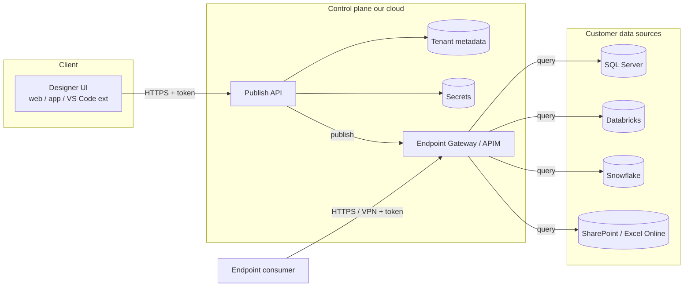
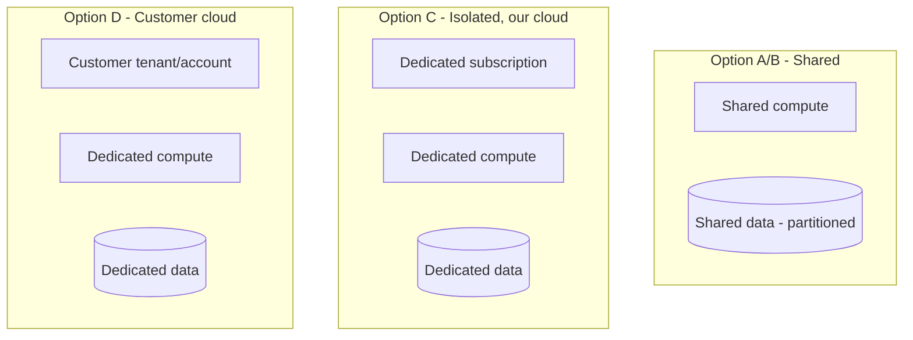
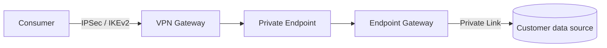
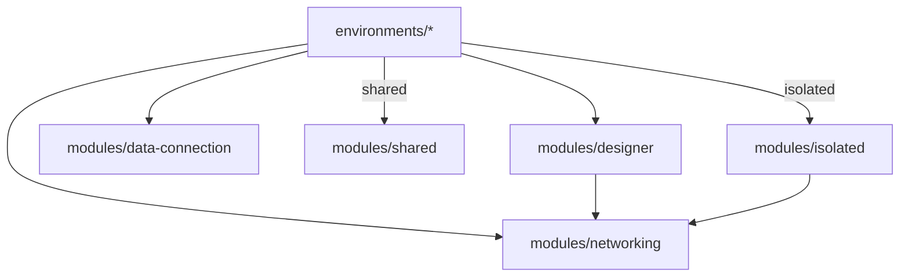

# Reference Architecture

## High-level

```mermaid
flowchart LR
    subgraph Client
        UI[Designer UI<br/>web / app / VS Code ext]
    end
    subgraph ControlPlane[Control plane our cloud]
        API[Publish API]
        META[(Tenant metadata)]
        KV[(Secrets)]
        APIM[Endpoint Gateway / APIM]
    end
    subgraph DataSources[Customer data sources]
        SQL[(SQL Server)]
        DBX[(Databricks)]
        SNOW[(Snowflake)]
        SP[(SharePoint / Excel Online)]
    end
    UI -->|HTTPS + token| API
    API --> META
    API --> KV
    API -->|publish| APIM
    APIM -->|query| SQL
    APIM -->|query| DBX
    APIM -->|query| SNOW
    APIM -->|query| SP
    Consumer[Endpoint consumer] -->|HTTPS / VPN + token| APIM
```

## Isolation models

```mermaid
flowchart TB
    subgraph A[Option A/B - Shared]
        sApp[Shared compute]
        sData[(Shared data - partitioned)]
    end
    subgraph C[Option C - Isolated, our cloud]
        cSub[Dedicated subscription]
        cApp[Dedicated compute]
        cData[(Dedicated data)]
    end
    subgraph D[Option D - Customer cloud]
        dTenant[Customer tenant/account]
        dApp[Dedicated compute]
        dData[(Dedicated data)]
    end
```

## Network — private inbound/outbound (Options B/C/D)

```mermaid
flowchart LR
    Consumer -->|IPSec / IKEv2| VPNGW[VPN Gateway]
    VPNGW --> PE[Private Endpoint]
    PE --> APIM[Endpoint Gateway]
    APIM -->|Private Link| SRC[(Customer data source)]
```

## Terraform module graph

```mermaid
flowchart TD
    env[environments/*] --> designer[modules/designer]
    env --> dataconn[modules/data-connection]
    env --> net[modules/networking]
    env -->|shared| shared[modules/shared]
    env -->|isolated| isolated[modules/isolated]
    designer --> net
    isolated --> net
```
