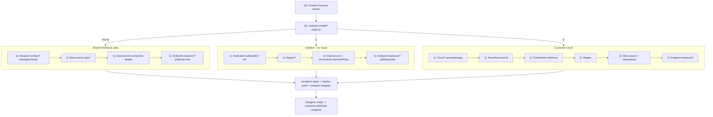

# Deployment User Flow

After purchase, the customer launches the wizard. It asks **one question per turn** and stores answers
in `deploy/answers.json`. Branches are driven by the **isolation** answer.

## Questions collected

| # | Key | Asked when | Example |
|---|-----|-----------|---------|
| 1 | `instanceName` | always | `contoso-prod` |
| 2 | `isolation` | always | `A` / `B` / `C` / `D` |
| 3 | `designerSurface` | always | `web` / `app` / `vscode` |
| 4 | `cloud` | D | `azure` / `aws` / `gcp` |
| 5 | `tenantId` | C, D | `00000000-...` |
| 6 | `subscriptionId` | C, D | `11111111-...` |
| 7 | `credentialRef` | D | `kv://customer-sp` |
| 8 | `region` | always | `eastus2` |
| 9 | `dataSourceType` | always | `sqlserver` / `databricks` / `snowflake` / `sharepoint` / `excelonline` |
| 10 | `dataConnectivity` | B, C, D | `internet` / `ipsec` |
| 11 | `dataSourceHost` | always | `sql.contoso.com` |
| 12 | `endpointExposure` | always | `public` / `private` |

## What happens after the last answer

1. Wizard validates answers and writes `deploy/answers.json`.
2. Wizard maps `isolation` → Terraform environment:
   - `A`/`B` → `infra/environments/shared`
   - `C` → `infra/environments/isolated`
   - `D` → `infra/environments/byo`
3. Runs `terraform init && terraform apply -var-file=<generated>.tfvars.json`.
4. Builds & pushes the app images (or reuses prebuilt ones).
5. Seeds the designer config so the UI is ready.
6. Prints the Designer URL and the (eventual) published-endpoint base URL.
